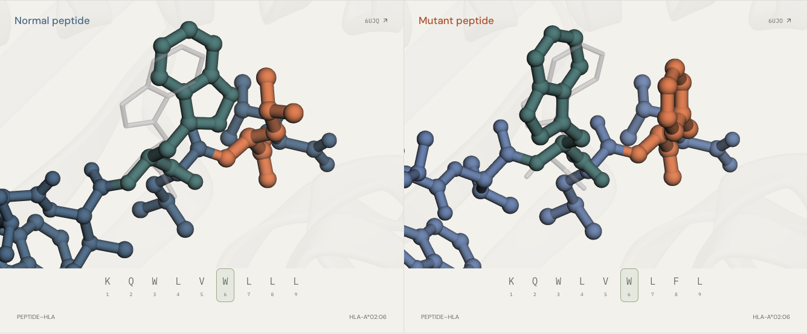
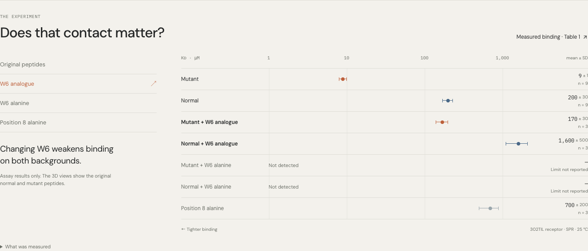
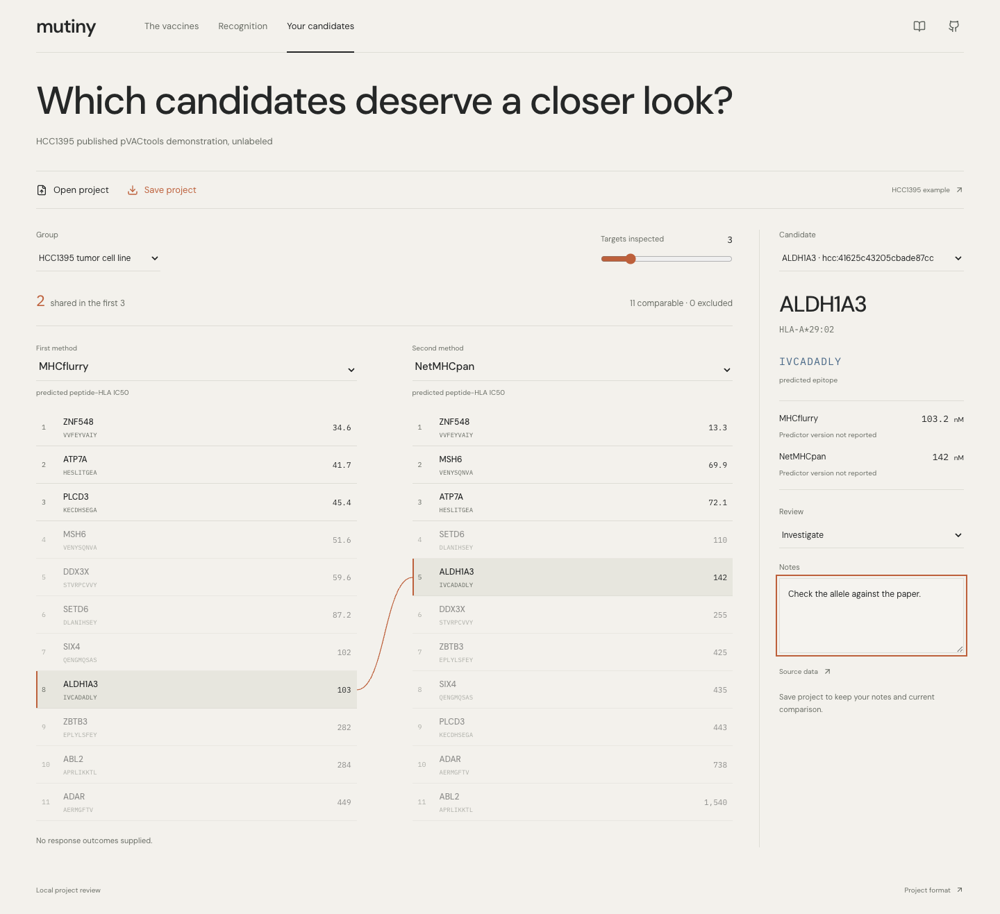

# mutiny

**Which cancer mutations trigger T cells?**

Cancer vaccines teach T cells what to recognize. Choosing those targets is the hard part.

Inspired by Radical Numerics’ [Omnii cancer-vaccine post](https://www.radicalnumerics.ai/blog/omnii-cancer-vaccines), mutiny lets you explore real vaccine outcomes, protein-language-model scores, and the molecular encounter in 3D.


**Normal and mutant peptides meet the same T-cell receptor.** Four experimental structures, with synchronized cameras and measurable contacts. This HHAT case is independent of the vaccine trial below.

### Start with the targets

232 vaccine targets. 16 patients. Each mark is a target. Start with the labels hidden.


### Reveal responses. Compare models.

Copper marks detected T-cell responses. Switch between ESM-2 sequence preference, predicted HLA binding, and chance; follow the same targets as their order changes.


### Test the contact

Follow the mutation → neighboring W6 → receptor contact. Compare measured crystal poses, then explore what happened when researchers altered that contact residue.





The comparison is exploratory: sequence preference and binding scores are not immune-response probabilities. [Biology, sources & limitations →](docs/SCIENCE.md)

### Bring your candidates

Open a project, compare rankings, follow a candidate, and save your notes. Includes an independent 11-candidate HCC1395 example. Project files stay in your browser.



The first reusable release opens **normalized project JSON**. [Example file](public/research/hcc1395.project.json) · [Format and scope](docs/PROJECTS.md)

### Try it

```sh
npm ci
npm run dev
```

No API keys or GPU needed. Results and structures are included.

[Development](docs/DEVELOPMENT.md) · [Deploy](docs/DEPLOYMENT.md) · [Next Rosalind tasks](outputs/ROSALIND_FOLLOWUP.md) · [MIT license](LICENSE)

Built with results from **Molecular Structure Viewer** and **Life Sciences Literature** in the Rosalind environment. [Actual plugin contributions](rosalind/PLUGIN_EXECUTION.md).
