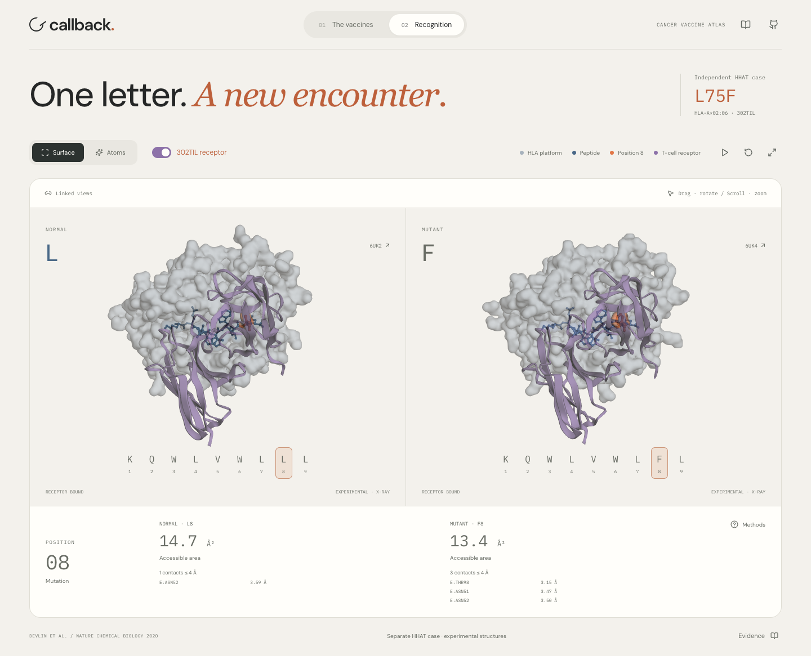

# Callback

**A cancer-vaccine recognition atlas.**

Explore 232 real vaccine target records from 16 patients, reveal measured T-cell responses, inspect frozen ESM-2 and MHCflurry scores, and explore four experimental HHAT structures in synchronized 3D.




## Run the app

Node.js 22 is recommended. All displayed results and structures are committed; starting the app needs no model downloads, API keys, account, or GPU.

```sh
npm ci
npm run dev
```

```sh
npm test
npm run build
```

## What is implemented

- 16 patient-specific vaccine target maps with stable target identities.
- Four outcome states: 23 individual positives, 200 responses not detected, seven unresolved pool members, two missing outcomes.
- ESM-2 650M masked-marginal scores on 197 strictly verified source-protein contexts.
- MHCflurry affinity estimates for all 232 published class-I peptide/allele pairs.
- Matched comparison subset: 188 individually labeled targets, including 22 positives and 166 non-detected responses.
- Reproducible within-patient shuffling and a central 90% reference envelope from 2,000 orderings.
- Synchronized molecular cameras, automatic rotation, an expanded 3D workspace, surface/atom views, receptor-bound state switch, residue selection, geometric contacts, and solvent-accessible areas.
- Source links, checksum audit, model revision, reference accessions and explicit exclusions.

The ranking interface explores associations. It does not validate a class-I immunogenicity predictor, rank all patient mutations, or predict clinical benefit. The original assay does not assign responding HLA class to every target. All records have both predicted class-I and class-II annotations.

## Scientific reproducibility

See [methods](docs/SCIENCE.md), [source manifest](data/derived/source-manifest.json), and [model lock](data/derived/model-lock.json).

```sh
python3.12 -m venv .venv
.venv/bin/pip install -r requirements-analysis.txt
.venv/bin/python scripts/fetch_sources.py
.venv/bin/python scripts/audit_rojas.py data/raw/rojas-2023-table5.xlsx
.venv/bin/python scripts/map_proteins.py
.venv/bin/python scripts/score_esm.py
MHCFLURRY_DATA_DIR="$PWD/work/model-cache/mhcflurry" TF_USE_LEGACY_KERAS=1 .venv/bin/mhcflurry-downloads fetch models_class1_pan
.venv/bin/python scripts/score_binding.py
.venv/bin/python scripts/combine_scores.py
.venv/bin/python scripts/prepare_data.py
.venv/bin/python scripts/prepare_structures.py
.venv/bin/python scripts/check_crystal_mates.py
npm test
```

ESM weights download on first use. Apple MPS is used where available; otherwise CPU. The completed run used MPS. Reference GenBank files are already cached in the repository. Do not silently replace them with newer versions. ESM resumes existing target scores; remove its derived score file only when intentionally recomputing the same locked method. If changing the method or checkpoint, use a separate result file and update provenance.

## Browser verification

With the app running, run `npx playwright install chromium` and `npm run test:browser`. For an already installed Chrome, set `CHROME_EXECUTABLE` to its executable path. Set `RECORD_DEMO=1` to capture a walkthrough (requires Playwright's FFmpeg installation). Screenshots and the real recording are written to `outputs/`. The browser checks cover desktop/mobile layouts, all orders, outcome preservation, evidence, PDB state changes, geometric contact labels and synchronized rotation.

## Rosalind handoff

**Rosalind Workbench has not been used in this build.** Its substantive independent-validation work is assigned in [the handoff](outputs/ROSALIND_HANDOFF.md). The other account does not need Astra. Do not add a Rosalind contribution claim or submit the project as built with Rosalind until that work actually happens.

## Deploy to Vercel

Import `Supernova-45/callback`, choose Vite, build with `npm run build`, and publish `dist`. No environment variables are required. Deployment is intentionally left as the final user-assisted step. See [deployment checklist](docs/DEPLOYMENT.md).

## Sources and licensing

- Rojas et al. (2023), [Nature](https://doi.org/10.1038/s41586-023-06063-y), Supplementary Table 5. Study data are attributed under the article's CC BY 4.0 terms.
- Devlin et al. (2020), [Nature Chemical Biology](https://doi.org/10.1038/s41589-020-0610-1). Experimental coordinates: [6UJQ](https://www.rcsb.org/structure/6UJQ), [6UJO](https://www.rcsb.org/structure/6UJO), [6UK2](https://www.rcsb.org/structure/6UK2), [6UK4](https://www.rcsb.org/structure/6UK4), via RCSB PDB. Renderings are generated from coordinates, not copied article figures.
- RefSeq transcript/CDS records via NCBI; returned versions and checksums are retained.
- ESM-2 [checkpoint](https://huggingface.co/facebook/esm2_t33_650M_UR50D) and [MHCflurry](https://github.com/openvax/mhcflurry).

Original Callback code is MIT licensed. Third-party data, model weights and dependencies retain their own terms. Model weights are not redistributed in this repository.
