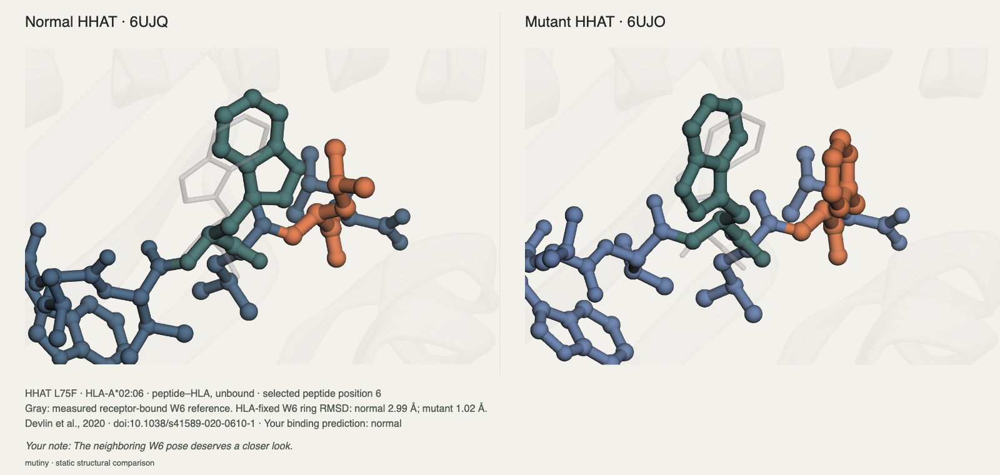
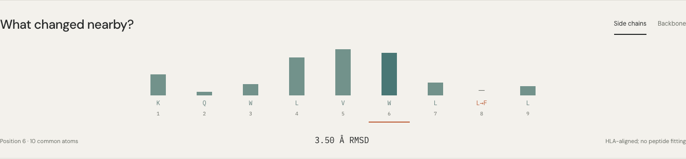
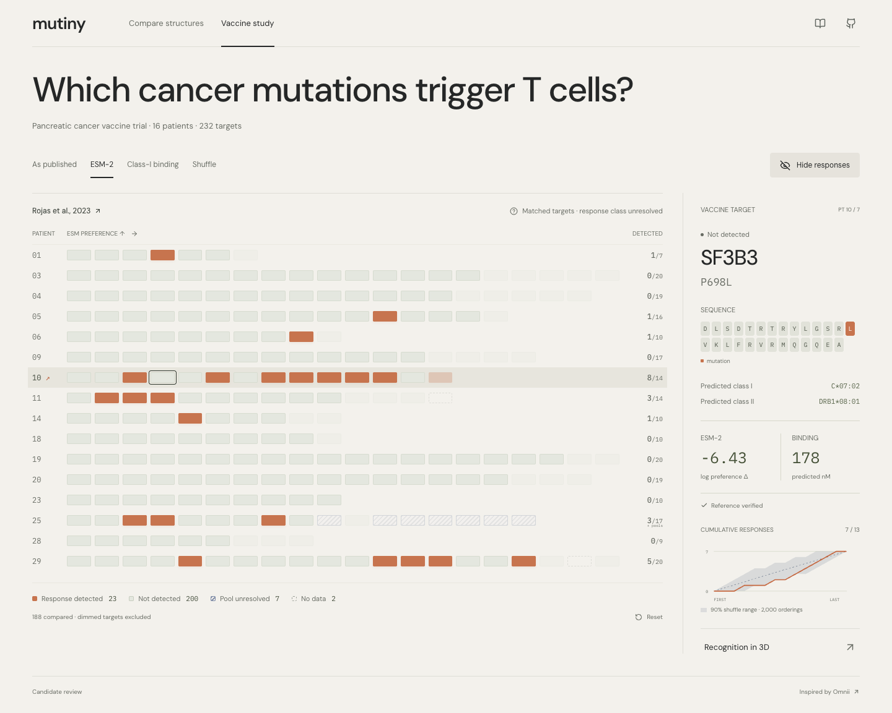

# mutiny

**Compare a normal and cancer-mutant peptide structure. See what changes beyond the mutation.**

One changed amino acid can reshape a neighboring residue—and change how a T-cell receptor binds. Explore the published HHAT case, make a prediction, then reveal the experiment.



**Bring your pair.** Open compatible PDBs, inspect neighboring residues in linked 3D, and compare backbone or side-chain differences. Save your view and notes, or export a figure. Files stay in your browser.



[Supported structures & file format](docs/STRUCTURE_COMPARISON.md) · [Example coordinates: normal](data/raw/6UJQ.pdb) / [mutant](data/raw/6UJO.pdb)

Inspired by Radical Numerics’ [Omnii cancer-vaccine post](https://www.radicalnumerics.ai/blog/omnii-cancer-vaccines). The **Vaccine study** view also compares ESM-2 and predicted HLA binding against 232 administered targets from 16 patients. HHAT is a separate structural case; geometry alone does not predict vaccine effectiveness.



```sh
npm ci
npm run dev
```

No API keys or GPU needed to run the app. Experimental structures and completed model scores are included.

Built with evidence from **Molecular Structure Viewer** and **Life Sciences Literature** in the Rosalind environment. The reusable comparison engine runs locally. [Actual plugin contributions](rosalind/PLUGIN_EXECUTION.md) · [Next Rosalind work](outputs/ROSALIND_STRUCTURAL_COMPARISON.md)

[Science](docs/SCIENCE.md) · [Development](docs/DEVELOPMENT.md) · [Deploy](docs/DEPLOYMENT.md) · [MIT license](LICENSE)
