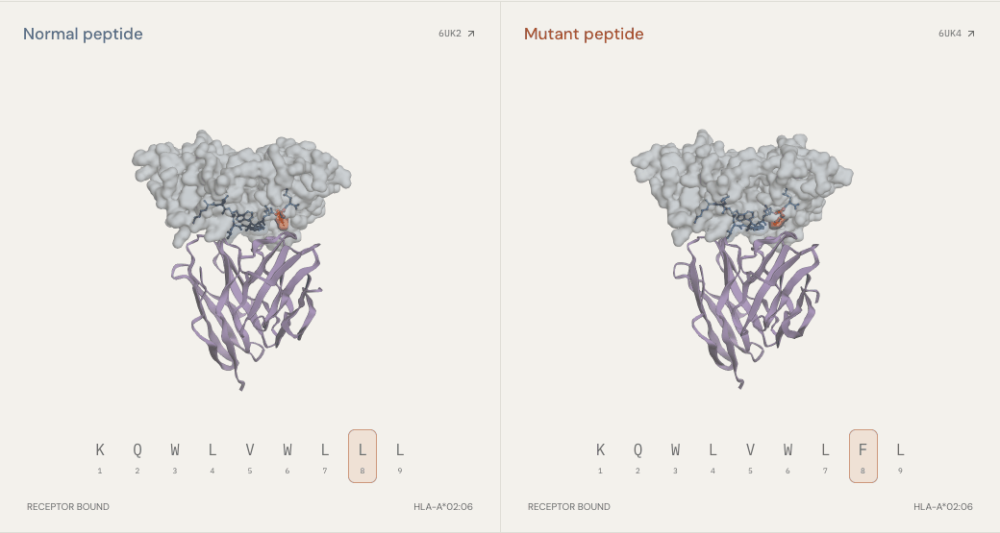
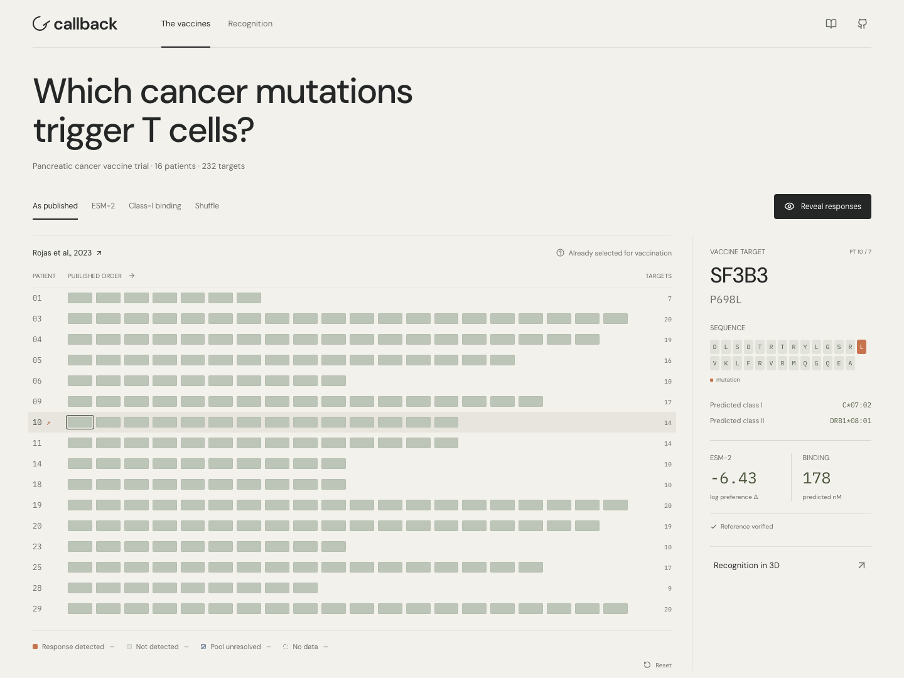
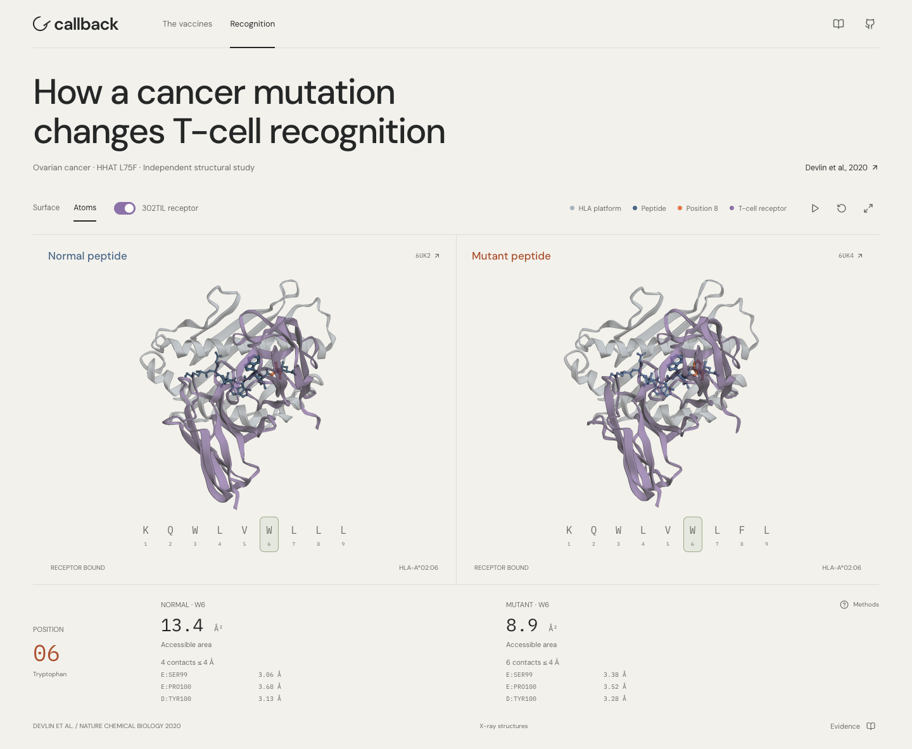

# Callback

**Which cancer mutations trigger T cells?**

Cancer vaccines teach T cells what to recognize. Choosing those targets is the hard part.

Inspired by Radical Numerics’ [Omnii cancer-vaccine post](https://www.radicalnumerics.ai/blog/omnii-cancer-vaccines), Callback lets you explore real vaccine outcomes, protein-language-model scores, and the molecular encounter in 3D.



**Normal and mutant peptides meet the same T-cell receptor.** Four experimental structures, with synchronized cameras and measurable contacts. This HHAT case is independent of the vaccine trial below.

### Start with the targets

232 vaccine targets. 16 patients. Each mark is a target. Start with the labels hidden.



### Reveal responses. Compare models.

Copper marks detected T-cell responses. Switch between ESM-2 sequence preference, predicted HLA binding, and chance; follow the same targets as their order changes.


### Get close enough to see the difference

Compare normal and mutant peptides, inspect individual atoms, and measure the receptor interface.



The comparison is exploratory: sequence preference and binding scores are not immune-response probabilities. [Biology, sources & limitations →](docs/SCIENCE.md)

### Try it

```sh
npm ci
npm run dev
```

No API keys or GPU needed. Results and structures are included.

[Development](docs/DEVELOPMENT.md) · [Deploy](docs/DEPLOYMENT.md) · [Rosalind handoff](outputs/ROSALIND_HANDOFF.md) · [MIT license](LICENSE)

Rosalind Workbench validation is pending.
