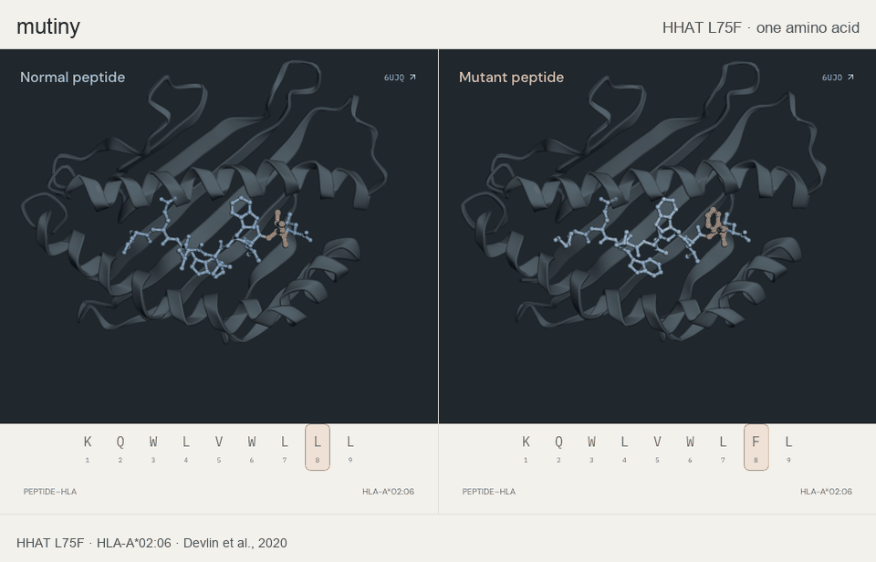
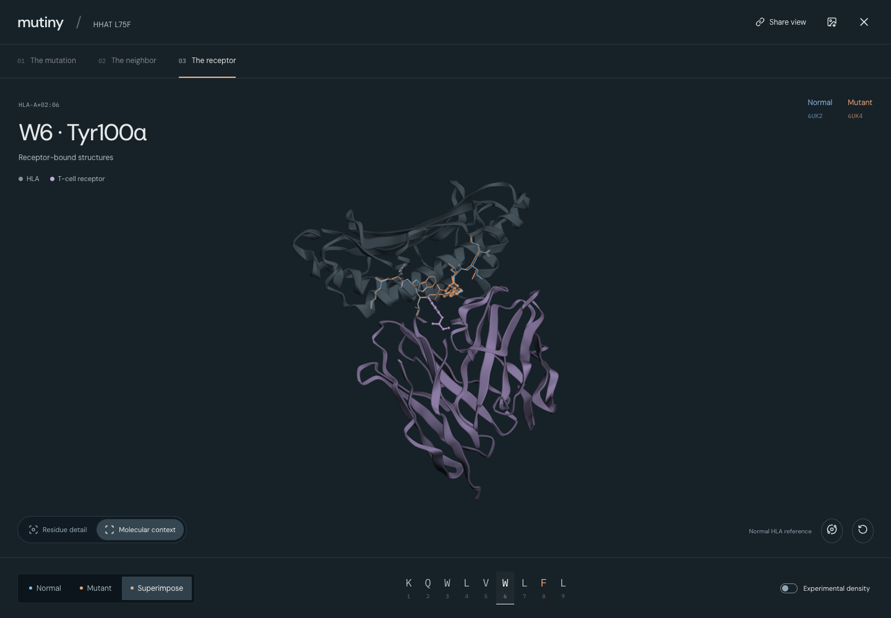
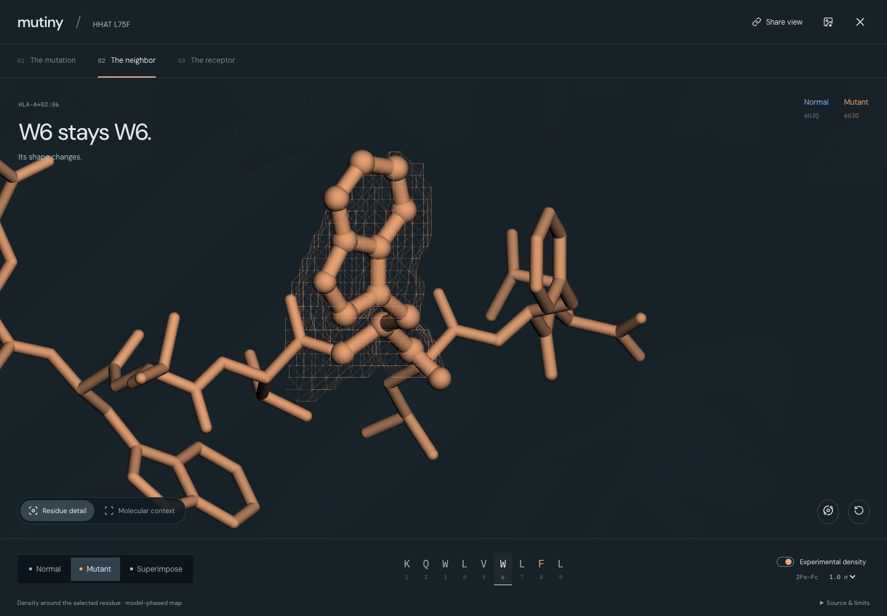
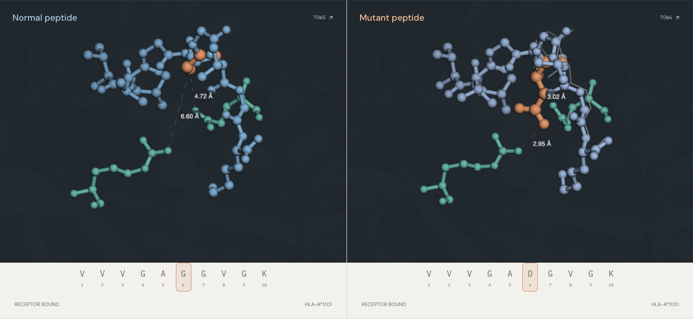

# mutiny

**[Try mutiny →](https://callback-psi-liard.vercel.app)**

**Compare a normal and cancer-mutant peptide structure. See what changes beyond the mutation.**



**From receptor to residue.** Pull back to the molecular context, orbit the assembly, then select a residue to move into the detail. Superimpose normal and mutant peptides, inspect experimental density, and share the exact view.





[How the maps are aligned](docs/EXPERIMENTAL_DENSITY.md)

**Bring your pair.** Open compatible PDBs, inspect neighboring residues in linked 3D, and compare backbone or side-chain differences. Save your view or export a figure. Files stay in your browser. Or start with the published HHAT case: inspect the structures, make a prediction, then reveal the binding experiment.

**Two cancer mutations, two experiments.** HHAT reveals a neighboring residue’s change in pose. KRAS asks whether similar structures mean similar receptor binding—then reveals the measured difference for an engineered receptor. [Try KRAS →](https://callback-psi-liard.vercel.app/?case=kras)




[Supported structures & file format](docs/STRUCTURE_COMPARISON.md) · [Example coordinates: normal](data/raw/6UJQ.pdb) / [mutant](data/raw/6UJO.pdb)

Inspired by Radical Numerics’ [Omnii cancer-vaccine post](https://www.radicalnumerics.ai/blog/omnii-cancer-vaccines). The **Vaccine study** view also compares ESM-2 and predicted HLA binding against 232 administered targets from 16 patients. HHAT is a separate structural case; geometry alone does not predict vaccine effectiveness.


```sh
npm ci
npm run dev
```

No API keys or model-compute setup needed. The interactive viewer uses WebGL. Experimental structures and completed model scores are included.

Built with **Molecular Structure Viewer**, **Biological Sequence & Alignment Viewer** and **Life Sciences Literature** in the Rosalind environment. The reusable comparison engine and PDBe density processing run locally. [Latest scientific return](rosalind/STRUCTURAL_RETURN.md) · [Earlier plugin contributions](rosalind/PLUGIN_EXECUTION.md) · [Next Rosalind work](outputs/ROSALIND_STRUCTURAL_COMPARISON.md)

Source tables and reference sequences are committed to preserve the exact bytes used in the analysis.

[Science](docs/SCIENCE.md) · [Development](docs/DEVELOPMENT.md) · [Deploy](docs/DEPLOYMENT.md) · [MIT license](LICENSE)
