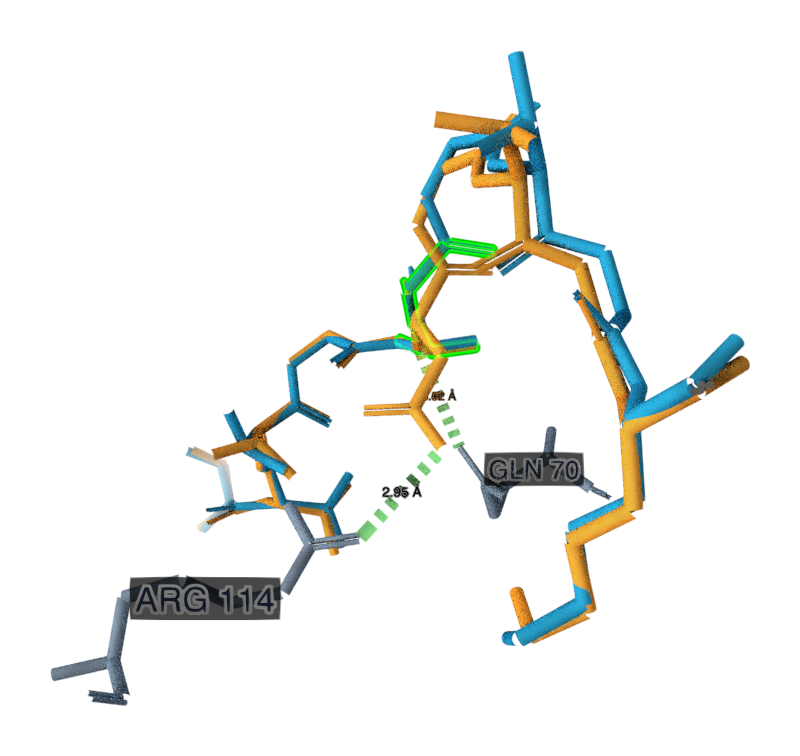

# KRAS G12D: a complete scientific contrast

`case.json` is the portable scientific return. It is **not a drop-in preset for the current strict importer**. The authentic normal/mutant pair fails observed HLA equality; the explicit shared-position fit is separately documented in `../comparison-review/README.md`.

[Poole et al., Nature Communications 13, 5333 (2022)](https://www.nature.com/articles/s41467-022-32811-1) studied the same engineered JDIa41b1 TCR bound to normal KRAS peptide VVVGAGGVGK and G12D peptide VVVGADGVGK, HLA-A*11:01. Table 2 reports TCR–pHLA SPR KD **3.0 μM normal** and **743 ± 18 pM mutant**, SD n=2. This is over 4,000-fold selectivity, not peptide–HLA affinity, cell killing or vaccine efficacy. The normal cell has no printed uncertainty. The method covers steady-state weak-affinity and kinetic strong-affinity regimes; per-cell instrument and baseline temperature are not explicitly assigned in the extracted source.

The predeclared visitor question, choices and measured reveal are in `case.json`. Choosing mutant matches the experiment; saying structure alone cannot establish affinity is a valid methodological caution. The parent JDI TCR and third-generation construct are different reagents and their measurements must not be substituted.

The shared whole-HLA Cα RMSD is **0.337252 Å**, independently reproduced by native Workbench. Peptide backbone common-atom RMSDs range from roughly 0.11 to 0.66 Å in that frame. The platform sensitivity fit is 0.276154 Å over 179 shared Cα. These numbers describe static structural similarity; they do not calculate selectivity or prove the paper's thermodynamic explanation.

Native and local measurements agree on mutant D6 N → HLA Q70 OE1 **3.023948 Å** and D6 OD2 → HLA R114 NH2 **2.951327 Å**. These are closest heavy-atom distances, not interaction energies or proof of a hydrogen bond. The first involves the peptide backbone N, not the Asp side-chain oxygen. Exact identities, operation requests and receipts are preserved. Native primary-WT nearest distances were about 4.72 and 6.60 Å; differing nearest atom pairs are not directly comparable interaction energies.

Native coordinate render: normal peptide blue, mutant orange, mutant HLA Q70/R114 gray; green selection/measurement highlighting is viewer state. The two distances belong to the mutant object. This is a local contact view after HLA alignment, **not density**, a whole-Workbench screenshot or a full receptor view. The crop/scene/transform provenance is retained in the adjacent `.render.json`. Opaque local viewer source URLs are redacted, with original sidecar hash; original coordinate files and hashes provide portable replay inputs. The first uncropped native render is retained too.

`coverage.json` checks all peptide copies of free 7OW3/7OW4 and the bound pair, including atom completeness, selected altlocs and occupancy. Every free mutant copy lacks P5/P6; no pose is invented. Normal free copies C/L are complete, while F/I are incomplete. All ten bound residues have expected heavy atoms under the recorded parser policy, blank altloc and occupancy 1. This does not prove density certainty. Table 3 has substantial peptide B factors (~78 Ų) and global Rfree ~27%; consult experimental data before detailed energetic claims.

RCSB and Table 3 agree on 7OW5 resolution 2.58 Å and 7OW6 2.64 Å; the paper's Results prose reverses those two numbers. We preserve this source discrepancy rather than choose the convenient value. No new map inspection occurred.

Files: `sources/` contains original PDBs, RCSB metadata, PMC XML and literature-plugin receipt; `retrieval.json` pins URLs/date/hashes. `assay-source-extracts.json` pins Table 2, Table 3 and methods. `independent-comparison.json` gives transforms, source mappings, exclusions and residue metrics. `contacts.json`, `native-contacts.json` and `native-sequences.json` separate local results from native operations.

PDB data are CC0 under [wwPDB policy](https://www.wwpdb.org/about/usage-policies); attribute depositors. Article XML/extracts are CC BY 4.0: credit Poole et al., link the DOI/license, and identify extraction/reformatting. New coordinate renders are not copied article figures. The static case does not import the paper's simulated trajectories, and no new simulation, prediction, training or frontend work was performed.
